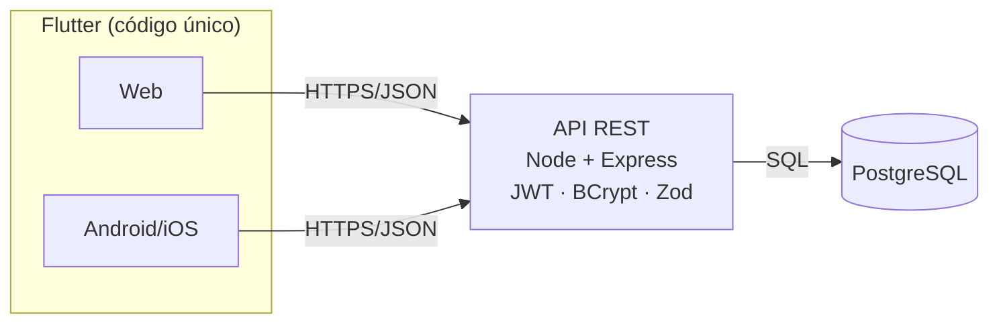

# Desperte Mulher — Reformulação (Projeto Final)


> Reformulação de **design, UX/UI, arquitetura e organização de código** do site
> [despertemulher.org](https://despertemulher.org/) — plataforma gratuita e
> anônima de **análise de risco para mulheres em situação de violência
> doméstica** (foco no Tocantins). **A lógica de negócio foi 100% preservada;**
> mudou-se apenas a forma.

## 1. Descrição

O sistema permite que uma mulher avalie, de forma **anônima e gratuita**, seu
nível de risco respondendo a um questionário; recebe uma **classificação**
(Muito Baixo → Extremo) e **encaminhamentos** para a rede de apoio. Inclui
**denúncia anônima**, conteúdo institucional e uma **área profissional
(Acolhe)** protegida por autenticação JWT.

## 2. Funcionalidades

- 🧭 **Análise de risco** (questionário → % → 5 faixas oficiais → encaminhamentos)
- 🆘 **Denúncia anônima** (formulário fiel ao original)
- 🔐 **Área Acolhe** (login/cadastro, painel, perfil — rotas protegidas)
- 📊 **Observatório** de indicadores
- ☎️ **Contatos de emergência** (180 / 190 / Ouvidoria)
- 🌗 Tema híbrido acessível (WCAG AA) · 📱 Responsivo (Web + Mobile)

## 3. Capturas de tela

Os prints ficam em [`docs/screenshots/`](docs/screenshots). Para gerar: rode o
app (`flutter run -d chrome` ou no emulador) e capture as telas Home,
Questionário, Resultado e Painel. Depois descomente o bloco abaixo:

<!--
| Home | Questionário | Resultado |
|------|--------------|-----------|
|  |  |  |
-->

## 4. Tecnologias

| Camada | Tecnologias |
|--------|-------------|
| Frontend | Flutter · Dart · BLoC/Cubit · GoRouter · Dio · GetIt · Material 3 · google_fonts · responsive_framework · screenutil |
| Backend | Node.js · Express · JWT · BCrypt · Zod · Helmet · PostgreSQL (pg) |
| Arquitetura | Clean Architecture · SOLID · Repository Pattern · Injeção de Dependência · Modularização |
| Deploy | Vercel/Firebase (web) · Render/Railway (API) · Supabase (DB) |

## 5. Arquitetura



No frontend, **Clean Architecture** por módulo (Presentation / Domain / Data); no
backend, camadas (Routes → Middlewares → Controllers → Services → Repositories).
Detalhes e mais diagramas em [docs/03-arquitetura.md](docs/03-arquitetura.md).

## 6. Instalação

```bash
# Pré-requisitos: Flutter 3.27+, Node 18+, PostgreSQL (ou Supabase)
git clone https://github.com/murillomagnnosr/desperte_mulher_mob-I.git
cd desperte_mulher_mob-I
cd frontend && flutter pub get && cd ..
cd backend  && npm install && cp .env.example .env   # ajuste o .env
```

## 7. Execução

```bash
# Frontend (mock, sem backend)
cd frontend && flutter run -d chrome
# Frontend consumindo a API real
flutter run -d chrome --dart-define=USE_MOCK=false
# Android (emulador ou device)
flutter run

# Backend
cd backend && npm run migrate && npm run seed && npm run dev

# Testes
cd frontend && flutter test     # 6 testes
```

## 8. Deploy

Vercel/Firebase (web) · Render/Railway (API) · Supabase (banco). Passo a passo
em [docs/16-deploy.md](docs/16-deploy.md).

## 9. Estrutura de pastas

```text
desperte_mulher_mob-I/
├── docs/        # documentação acadêmica (etapas 1–17)
├── frontend/    # app Flutter (lib/core, lib/modules, lib/shared)
└── backend/     # API Express (src/{routes,controllers,services,repositories,middlewares,database})
```

## 10. Fluxo do sistema

`Home → (Termos) → Questionário → Resultado → Rede de apoio`, e
`Login do Acolhe → Painel` (protegido). Sequência técnica em
[docs/12-integracao.md](docs/12-integracao.md).

## 11. Documentação (por etapa)

| Etapa | Documento |
|------|-----------|
| 01 | [Engenharia reversa](docs/01-engenharia-reversa.md) |
| 02 | [Mockups e design](docs/02-mockups.md) |
| 03 | [Arquitetura](docs/03-arquitetura.md) |
| 04 | [Estrutura Flutter](docs/04-estrutura-flutter.md) |
| 10 | [Backend (API)](docs/10-backend.md) |
| 11 | [Banco de dados (MER/DER)](docs/11-banco-de-dados.md) |
| 12 | [Integração Flutter↔API](docs/12-integracao.md) |
| 13 | [Responsividade](docs/13-responsividade.md) |
| 15 | [Testes](docs/15-testes.md) |
| 16 | [Deploy](docs/16-deploy.md) |
| 17 | [Roteiro de apresentação (banca)](docs/17-roteiro-apresentacao.md) |
| — | [Progresso das 17 etapas](docs/PROGRESSO.md) |

## 12. Conclusão

Sistema **profissional, limpo, testável e responsivo**, que moderniza a
experiência sem alterar a lógica que protege vidas. A arquitetura
(Clean Architecture + SOLID) garante manutenibilidade: trocar o questionário
pelo instrumento validado, ligar a API ou publicar é direto, sem reescrever
telas ou regras.

## Tema visual

Híbrido **Moderno/Feminino + Institucional**: violeta `#6A2C8C` (acolhimento) +
teal `#0E6E7D` (confiança) + coral `#F2685B` (CTA), Poppins + Inter, acessível
(WCAG AA). Tokens em `frontend/lib/core/theme/`.

---
*Projeto acadêmico (TCC / Programação Mobile). Baseado no domínio público de
despertemulher.org; conteúdo sensível tratado com responsabilidade.*
