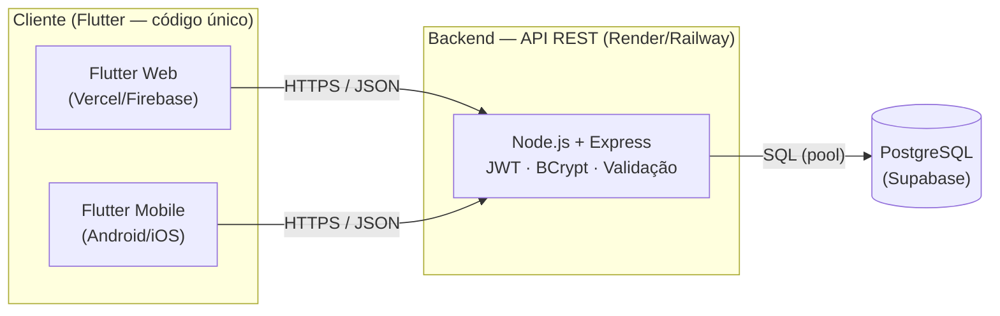
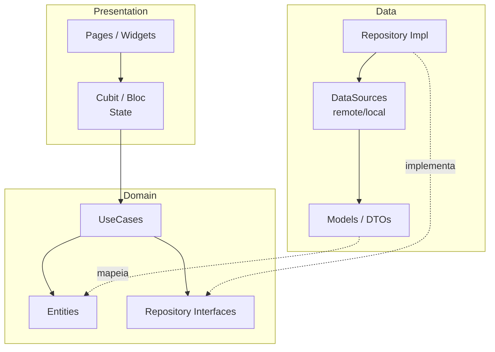
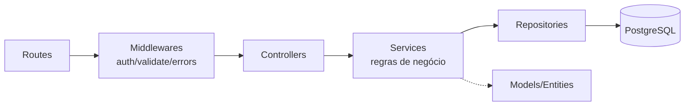
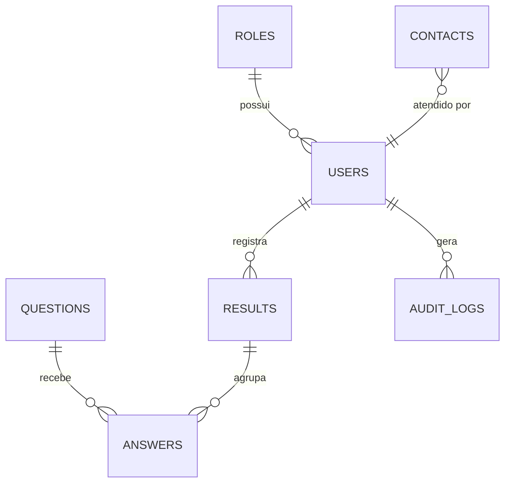
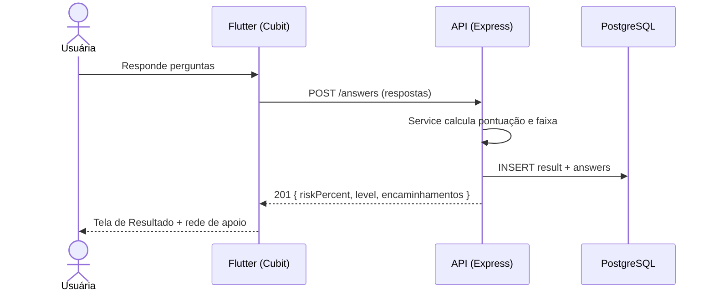

# Etapa 3 — Arquitetura do Sistema

## 3.1 Macro Arquitetura

Aplicação cliente Flutter (Web + Mobile a partir de um único código) consumindo
uma API REST em Node.js/Express, com PostgreSQL como banco relacional.

| Camada | Tecnologia | Hospedagem |
|--------|-----------|------------|
| Frontend Web | Flutter Web | Vercel / Firebase Hosting |
| Frontend Mobile | Flutter (APK/AAB) | Google Play (build) |
| Backend | Node.js + Express | Render / Railway |
| Banco | PostgreSQL | Supabase |

## 3.2 Micro Arquitetura — Frontend (Clean Architecture)

Cada módulo (`home`, `analise`, `authentication`, ...) é dividido em três
camadas. A dependência aponta **sempre para dentro** (Presentation → Domain ←
Data): o Domínio não conhece Flutter nem Dio.

**Por quê?** Testabilidade (o Domínio é Dart puro, testável sem device),
substituibilidade (trocar Dio por outro HTTP sem tocar em regras) e clareza para
a banca. Atende SOLID — em especial **D** (inversão: UseCases dependem de
interfaces) e **S** (cada classe, uma responsabilidade).

## 3.3 Micro Arquitetura — Backend (camadas)

- **Routes:** declaram endpoints e ligam ao controller.
- **Middlewares:** autenticação JWT, validação de entrada, tratamento de erros.
- **Controllers:** orquestram req/res; sem regra de negócio.
- **Services:** regras de negócio (ex.: cálculo de risco, emissão de token).
- **Repositories:** acesso a dados (SQL parametrizado).
- **Models:** representação das entidades.

## 3.4 Banco de Dados (visão preliminar)

Detalhado na Etapa 11 (MER/DER + DDL). Visão de entidades:

## 3.5 Fluxo ponta a ponta (Análise de Risco)

