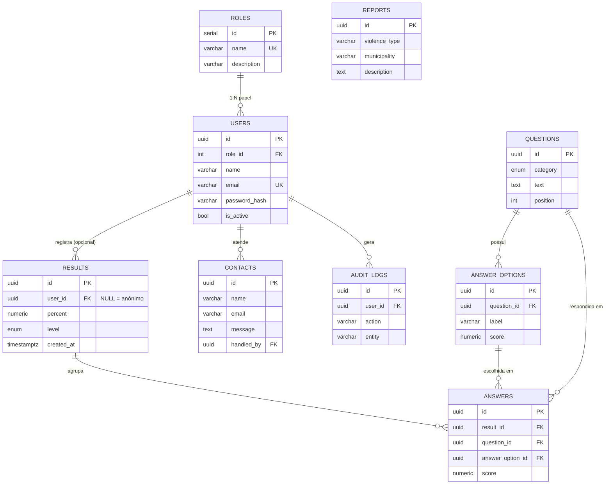

# Etapa 11 — Banco de Dados (MER / DER)

DDL completo em [`backend/src/database/schema.sql`](../backend/src/database/schema.sql).
Migração: `npm run migrate` · Seed: `npm run seed`.

## DER (Diagrama Entidade-Relacionamento)

## Relacionamentos (explicação)

| Relação | Cardinalidade | Justificativa |
|--------|----------------|---------------|
| ROLES → USERS | 1:N | Cada profissional tem um papel; um papel se aplica a vários. |
| QUESTIONS → ANSWER_OPTIONS | 1:N | Cada pergunta tem várias opções com peso (score). |
| RESULTS → ANSWERS | 1:N | Uma análise concluída agrupa as respostas dadas. |
| QUESTIONS/ANSWER_OPTIONS → ANSWERS | 1:N | Cada resposta referencia a pergunta e a opção escolhida. |
| USERS → RESULTS | 1:N (opcional) | `user_id` é **NULL** em análises anônimas — preserva o anonimato do site. |
| REPORTS | — | Denúncia **anônima**: sem FK para usuário, por princípio. |
| USERS → CONTACTS | 1:N (opcional) | `handled_by` marca quem tratou a mensagem. |
| USERS → AUDIT_LOGS | 1:N | Trilha de auditoria de ações sensíveis. |

## Decisões de modelagem

- **UUID** como PK das entidades sensíveis (results, reports) — IDs não
  sequenciais dificultam enumeração/inferência.
- **Tipos ENUM** (`risk_level`, `risk_category`) garantem integridade da
  classificação no nível do banco.
- **`ON DELETE CASCADE`** em options/answers (dependem do pai) e
  **`SET NULL`** onde o histórico deve sobreviver (results/contacts/audit).
- **Anonimato**: `results.user_id` e a tabela `reports` não exigem identidade.
- **Senhas**: somente `password_hash` (BCrypt) — nunca texto puro (Etapa 14).
- **Índices** nas colunas de busca (email, FKs, datas, município).
