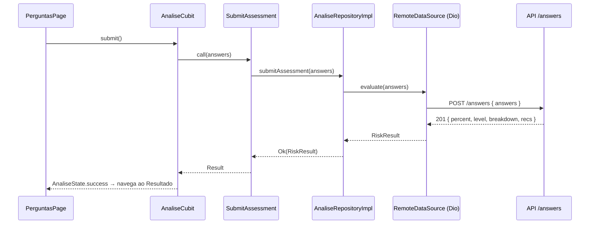

# Etapa 12 — Integração Flutter ↔ API

A integração reaproveita as peças já existentes na Clean Architecture, sem
reescrever telas nem regras: troca-se apenas a **fonte de dados**.

## Peças (já implementadas)

| Papel | Arquivo |
|------|---------|
| ApiClient / DioService | `core/network/dio_client.dart` (injeta JWT, trata 401, logs) |
| Endpoints | `core/network/api_endpoints.dart` |
| DTOs / Models | `modules/analise/data/models/question_model.dart` |
| DataSource remoto | `modules/analise/data/datasources/analise_remote_datasource.dart` |
| Repository | `analise_repository_impl.dart` (mapeia exceções → Failures) |
| UseCases | `get_questions.dart`, `submit_assessment.dart` |

## Interruptor mock ↔ API

A escolha é feita em `AppConfig.useMockData` e aplicada no `analise_module.dart`:

```dart
sl.registerLazySingleton<AnaliseDataSource>(() {
  final config = sl<AppConfig>();
  return config.useMockData
      ? const AnaliseLocalDataSource()         // offline
      : AnaliseRemoteDataSource(sl<DioClient>()); // API real
});
```

Rodar contra a API real:

```bash
# 1) suba o backend (precisa de PostgreSQL): cd backend && npm run dev
# 2) rode o app consumindo a API:
cd frontend
flutter run -d chrome --dart-define=ENV=development --dart-define=USE_MOCK=false
```

## Fluxo completo (questionário)



## Contrato compatível

O JSON da API casa com os DTOs do app:

- `GET /questions` → `[{ id, category, text, options:[{id,label,score}] }]`
  (`category` usa os nomes do enum: `violencia`, `controle`, ...).
- `POST /answers` → `{ id, percent, level, categoryBreakdown, recommendations }`.

> O mesmo padrão (datasource remoto + flag) vale para os módulos de
> autenticação, denúncia e contato — os endpoints já existem no backend.
