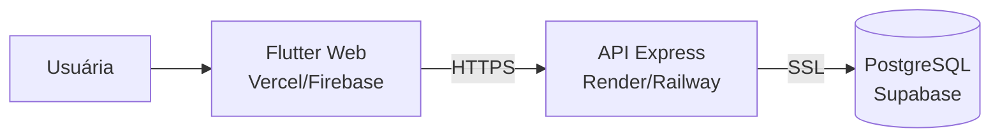

# Etapa 16 — Deploy

Arquitetura de publicação: **Frontend** (Vercel/Firebase) · **Backend**
(Render/Railway) · **Banco** (Supabase PostgreSQL).



## 1. Banco — Supabase

1. Crie um projeto em supabase.com (plano free).
2. Copie a *connection string* (Settings → Database).
3. Rode o schema e o seed apontando para ela:
   ```bash
   cd backend
   # .env: DATABASE_URL=postgresql://...supabase...  PGSSL=true
   npm run migrate
   npm run seed
   ```

## 2. Backend — Render (ou Railway)

1. Suba o repositório no GitHub.
2. New → Web Service, raiz = `backend/`.
3. Build: `npm install` · Start: `npm start`.
4. Variáveis de ambiente (do `.env.example`): `DATABASE_URL`, `PGSSL=true`,
   `JWT_ACCESS_SECRET`, `JWT_REFRESH_SECRET`, `CORS_ORIGINS` (URL do front),
   `NODE_ENV=production`.
5. A API responde em `https://<seu-servico>.onrender.com/api/v1`.

## 3. Frontend — Vercel (ou Firebase Hosting)

Build apontando para a API de produção:

```bash
cd frontend
flutter build web --release \
  --dart-define=ENV=production \
  --dart-define=USE_MOCK=false
```

### Vercel
- Faça deploy da pasta `build/web` (ou configure o build command).
- `vercel --prod` (com a pasta `build/web` como output).

### Firebase Hosting
```bash
firebase init hosting     # public dir = build/web, SPA = yes
firebase deploy --only hosting
```

> SPA: configure rewrite de todas as rotas para `/index.html` (GoRouter usa
> rotas baseadas em URL).

## 4. Checklist de produção

- [ ] Segredos JWT longos e aleatórios (não os de exemplo).
- [ ] `CORS_ORIGINS` com o domínio real do frontend.
- [ ] `PGSSL=true` no Supabase.
- [ ] `flutter test` e `npm test` verdes antes do deploy.
- [ ] HTTPS ponta a ponta.
